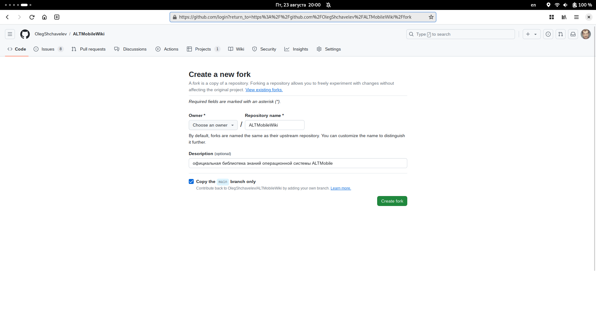
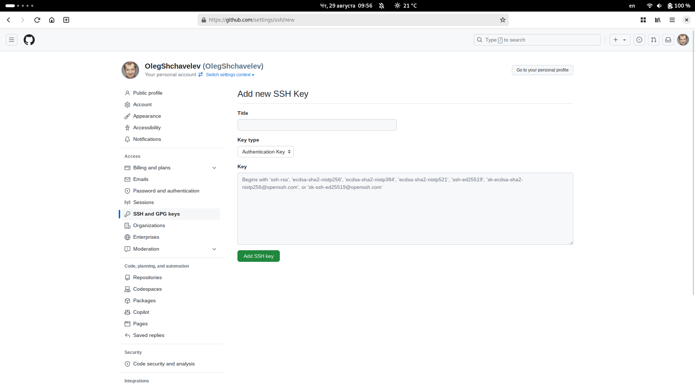

# Внесение изменений

Для внесения изменений в базу знаний необходимо завести учётную запись в веб-сервисе GitHub.

GitHub – веб-сервис, который помогает участникам совместно работать над IT-проектами. Он основан на системе контроля версий Git. На GitHub разработчики могут публиковать свой код и редактировать код других пользователей, комментировать проекты и узнавать о последних новостях от других участников сообщества.

- Зайдите на сайт GitHub и нажмите кнопку «Sign up».
- Введите имя пользователя и адрес электронной почты, который вы использовали при настройке Git. Также вам потребуется пароль.
- После этого на указанный вами адрес электронной почты придёт код активации. Введите его на сайте.
- Затем выберите тарифный план.
- Опросы и выбор интересов можете пропустить.

## Создаём личную копию репозитория (fork)

Перейдите на страницу репозитория проекта ALT Mobile Wiki, нажмите кнопку «fork» и заполните форму:



Название и описание проекта можно оставить по умолчанию. Нажмите кнопку «Create fork». После небольшого ожидания репозиторий появится в вашем профиле GitHub.

## Клонирование репозитория

**Клонируйте** созданную ранее личную копию репозитория, заменив `USER` на имя пользователя GitHub:

::: code-group

```shell[https]
git clone https://github.com/USER/ALTRegularGnomeWiki.git
```

```shell[ssh]
git clone git@github.com:USER/ALTRegularGnomeWiki.git
```

:::

:::info Устанавливаем SSH-ключ

Откройте терминал и скопируйте туда эту команду. Не забудьте подставить в кавычки почту.

```shell
ssh-keygen -t ed25519 -C "name@example.ru"
```

Терминал предложит ответить на несколько вопросов таких как: название файла и пароль. В результате будет создан новый SSH-ключ, привязанный к вашей электронной почте.

Добавьте ключ в менеджер ключей SSH:

```shell
ssh-add ~/.ssh/id_ed25519
```

Перейдите на страницу для работы с ключами в профиле на GitHub и нажмите кнопку «New SSH key» или перейдите сразу на [страницу добавления SSH-ключа](https://github.com/settings/ssh/new).



Вставьте публичный ключ и нажмите кнопку «Add SSH key». Если потребуется, введите пароль от GitHub, чтобы подтвердить сохранение. Если всё сделано верно, новый ключ появится [в списке ключей](https://github.com/settings/keys)

:::

## Как отправить изменение в проект ALT Mobile Wiki

Перед внесением изменений ознакомьтесь с правилами и возможностями VitePress. После завершения изменений выполните следующие команды:

- Добавьте изменения в индекс Git:

::: tabs
== Терминал

```shell
git add --all
```

== VSCodium
Нажимаем `+` около имени файла

:::

- Создайте коммит:

::: tabs
== Терминал

```shell
git commit -m "commit message"
```

Замените `commit message` на описание ваших изменений.

== VSCodium
Добавьте описание и нажмите «Сommit»,

:::

:::info
Описание необходимо писать на русском языке.

Также рекомендуются следующие приставки:

- `data:`
- `docs:`
- `dev:`
- `config:`
- `chore:`

Например:

```
docs: Для авторов | Страница приложения
```

:::

- Отправьте изменения на GitHub:

::: tabs
== Терминал

```shell
git push
```

== VSCodium
Нажмите «Синхронизировать изменения»

:::
